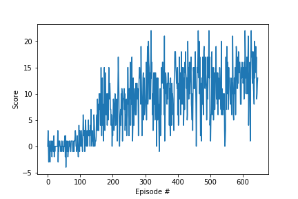

# REPORT

This document describes the details the agent implementation, its performance and ideas for future work.

Watch the agent in action! https://youtu.be/TcdG1JvhG3k

## The Agent model

The agent is a dueling neural network with 2 hidden layers with ReLU activation:

- The first hidden layer is a fully connected linear layer with 128 neurons.
- The second hidden layer consists of two linear layers:
  - The advantage layer is a fully connected linear layer with 128 neurons.
  - The value layer is a fully connected linear layer with 32 neurons.
- The output layer consists of two linear layers:
  - The advantage output layer is a fully connected linear layer with 4 outputs (1 per action).
    The output of the advantage layer is the linear layer subtracting its mean.
  - The value layer output layer is a fully connected linear layer with 1 output.
  - The final output is the sum of the advantage output (4 outputs) and value output (scalar).

## Training features

The training consists of a deep q-learning with some improved features:
- learning rate of 1e-3,
- Adam solver using MSE as cost function,
- actions decided on an epsilon-greedy manner,
- decaying epsilon from 1. to 0.01, according to a logarithmic decay based on average score in last 100 episodes,
- experience replay in 64 sized mini-batches extracted from the previous 10^5 steps,
- prioritized experience replay, with an epsilon of 1e-6 and a parameter of 0.5,
- fixed Q-target with doubleDQN, where the target network is updated every 1000 steps,
- gradient clipped to 1.

## Training performance

The trained algorithm achieved the target performance in 647 episodes:

## Upgrade ideas

Some other ideas could be incorporated to create a rainbow DQN:
- multi-step bootstrap targets,
- distributional DQN,
- noisy DQN.
